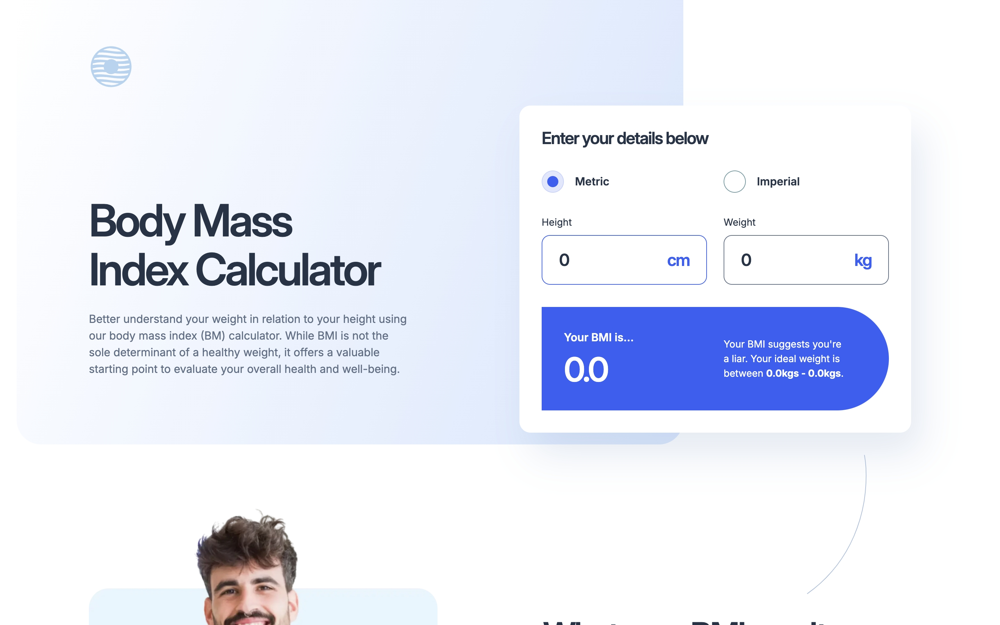
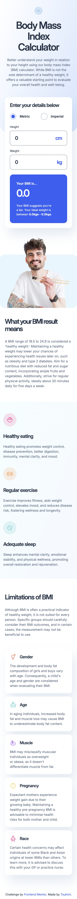
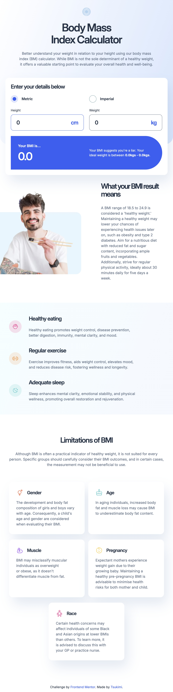
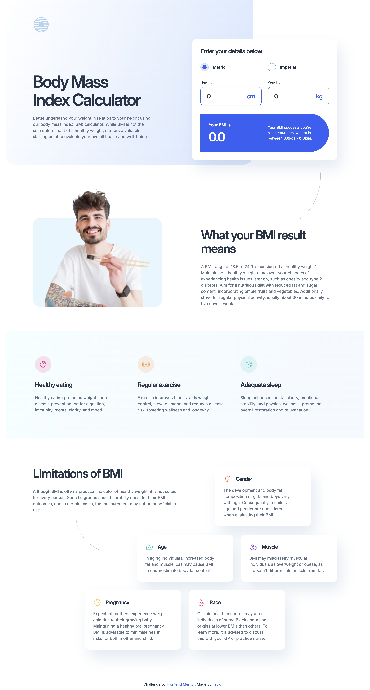

# Frontend Mentor - Body Mass Index Calculator solution

This is a solution to the [Body Mass Index Calculator challenge on Frontend Mentor](https://www.frontendmentor.io/challenges/body-mass-index-calculator-brrBkfSz1T). Frontend Mentor challenges help you improve your coding skills by building realistic projects.

## Table of contents

- [Frontend Mentor - Body Mass Index Calculator solution](#frontend-mentor---body-mass-index-calculator-solution)
  - [Table of contents](#table-of-contents)
  - [Overview](#overview)
    - [The challenge](#the-challenge)
    - [Screenshot](#screenshot)
    - [Links](#links)
  - [My process](#my-process)
    - [Built with](#built-with)
    - [Continued development](#continued-development)
  - [Author](#author)

## Overview

### The challenge

Users should be able to:

- Select whether they want to use metric or imperial units
- Enter their height and weight
- See their BMI result, with their weight classification and healthy weight range
- View the optimal layout for the interface depending on their device's screen size
- See hover and focus states for all interactive elements on the page

### Screenshot

Preview

Mobile

Tablet

Desktop

### Links

- [Live Site URL](https://bmi-calculator.frilly.dev/)

## My process

At first, because of the weird positioning of the background and the calculator, I was going to use absolute positioning on the calculator section. But it got too cumbersome and annoying to manage for each screen size, I ended up making the background absolute instead of the calculator, and it turned out better than I thought.

The last section looked pretty intimidating. Using a grid with 12 columns may not be the optimal answer, but it worked out perfectly.

### Built with

- [Astro](https://astro.build/)
- [Vue](https://vuejs.org/)
- [Tailwind CSS](https://tailwindcss.com/)

### Continued development

I planned to try `i18n` with Astro, but there was a lot of text content, that I'm too lazy to translate to try that. I'll try it on the next project if the text content is not too much.

## Author

- Website - [frilly.dev](https://frilly.dev/)
- Frontend Mentor - [@hikawi](https://www.frontendmentor.io/profile/hikawi)
